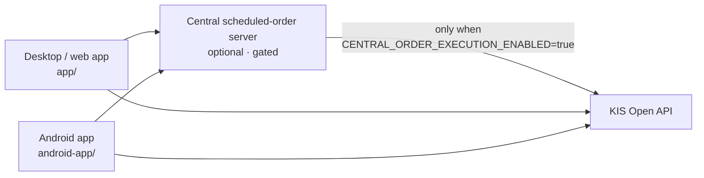

# Korea Investment Dashboard

> Personal Korea Investment & Securities (KIS) account dashboard — desktop, web, and Android

[한국어](README.md) · [MIT License](LICENSE) · Python · Android · 

A personal dashboard that shows your Korea Investment & Securities portfolio, assets,
and trade history in one place. It bundles a desktop/web app, an Android app, and a
GitHub Releases-based update pipeline.

**This project is not read-only.** It includes a central scheduled-order server slice
for small (1–2 user) setups, and actual KIS order execution runs only when explicitly
enabled with `CENTRAL_ORDER_EXECUTION_ENABLED`. It does nothing unless you turn it on.

## Architecture



## Quick start

Grab a platform artifact from the releases page:
https://github.com/ianlyoo/koreainv-dashboard/releases

| Platform | Artifact |
|---|---|
| Android | `KISDashboard-android.apk` |
| Windows | `KISDashboard-win64.zip` |
| macOS | `KISDashboard-mac-arm64.zip` |

On first launch, enter your KIS Open API key/account details; on Android, set a PIN and
unlock with it afterward.

## Features

| Feature | Description |
|---------|-------------|
| Portfolio summary | Total valuation, valuation P/L, return, asset status |
| Asset detail | Holdings, quantity, valuation, P/L, allocation |
| Trade history | Domestic/overseas trades and realized P/L |
| Currency toggle | KRW/USD display toggle on Android |
| Security | Android PIN lock and local credential storage |
| Updates | GitHub Releases version checks, recommended/mandatory update handling |

## Central scheduled-order server (optional)

A central scheduled-order server slice is included for 1–2 user setups.

- Enable server mode with `CENTRAL_ORDER_SERVER_MODE=true`.
- Remote clients authenticate with `CENTRAL_ORDER_SERVER_TOKEN`.
- Stored execution credentials are encrypted with `CENTRAL_ORDER_MASTER_KEY` (Fernet).
- Due orders are polled every `CENTRAL_ORDER_POLL_INTERVAL_SECONDS` by an in-process worker.
- **Actual KIS execution is gated solely by `CENTRAL_ORDER_EXECUTION_ENABLED=true`.**
- Scheduled orders are stored in `scheduled_orders.json` under the writable user-data directory.
- Starter systemd unit: `scripts/koreainv-dashboard-central.service.example`

## Configuration reference

| Environment variable | Required | Description |
|---|---|---|
| `CENTRAL_ORDER_SERVER_MODE` |  | Enables central server mode |
| `CENTRAL_ORDER_SERVER_TOKEN` | in server mode | Remote client auth token |
| `CENTRAL_ORDER_MASTER_KEY` | in server mode | Fernet key encrypting stored credentials |
| `CENTRAL_ORDER_EXECUTION_ENABLED` |  | Gate for actual KIS order execution (off by default) |
| `CENTRAL_ORDER_POLL_INTERVAL_SECONDS` |  | Due-order polling interval |
| `CENTRAL_ORDER_REMOTE_URL` |  | Central server URL a desktop client forwards orders to |
| `CENTRAL_ORDER_REMOTE_TOKEN` |  | Token for remote forwarding |
| `COOKIE_SECURE` |  | `true` when deployed behind HTTPS |

### Oracle Ubuntu deployment notes

1. Generate a Fernet key for `CENTRAL_ORDER_MASTER_KEY`.
2. Set `COOKIE_SECURE=true`.
3. Run behind an HTTPS reverse proxy (Nginx/Caddy) and keep `CENTRAL_ORDER_SERVER_TOKEN` private.
4. Set `CENTRAL_ORDER_REMOTE_URL`/`CENTRAL_ORDER_REMOTE_TOKEN` on desktop clients that forward to the central server.

## Security

- Because an order-execution path exists, `CENTRAL_ORDER_EXECUTION_ENABLED` is enabled only when you deliberately turn it on.
- Stored execution credentials are encrypted at rest with `CENTRAL_ORDER_MASTER_KEY`.
- Never share API keys, account numbers, PINs, or config files.
- Expose the central server only behind HTTPS and keep the server token private.

## Releases

Released via the GitHub Actions `Build And Release` workflow (`.github/workflows/release.yml`).

- Tag push: `v*`
- The tag version must match `app/version.py` (`APP_VERSION`) and `android-app/app/build.gradle.kts`.

```bash
git tag -a v1.6.5 -m "Prepare v1.6.5 release"
git push origin v1.6.5
```

An annotated tag message containing any of `[mandatory-update]`, `mandatory-update`,
`update_policy: mandatory`, or `필수 업데이트` marks the release as a mandatory update.

## Development

```bash
python -m app.main            # web/local app
build_windows.bat             # Windows build
./scripts/build_mac_app.sh    # macOS build
cd android-app && ./gradlew assembleRelease   # Android
```

Version sources: `app/version.py` for desktop/web, `android-app/app/build.gradle.kts`
for Android. Policy doc: `RELEASE_POLICY.md`.

## Troubleshooting

| OS | Paths |
|---|---|
| Windows | Settings `%APPDATA%\KISDashboard\settings.json`, logs `%APPDATA%\KISDashboard\logs\` |
| macOS | Logs `~/Library/Logs/KISDashboard/`, updates `~/Library/Application Support/KISDashboard/updates` |

## Disclaimer

This is an investment aid and carries no responsibility for investment losses. Do not
share API keys, account numbers, PINs, or config files.

## License

[MIT](LICENSE) © 2026 AhnRyu
