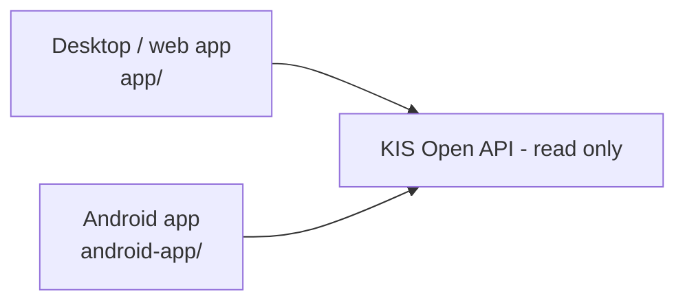

# Korea Investment Dashboard

> Personal Korea Investment & Securities (KIS) account dashboard — desktop, web, and Android

[한국어](README.md) · [MIT License](LICENSE) · Python · Android · 

A personal dashboard that shows your Korea Investment & Securities portfolio, assets,
and trade history in one place. It bundles a desktop/web app, an Android app, and a
GitHub Releases-based update pipeline.

The dashboard is read-only for broker operations. It supports portfolio, balance,
market and historical execution queries. Order registration, submission, scheduling,
modification and cancellation are not supported.

## Architecture



## Quick start

Grab a platform artifact from the releases page:
https://github.com/ianlyoo/koreainv-dashboard/releases

| Platform | Artifact |
|---|---|
| Android | `KISDashboard-android.apk` |
| Windows | `KISDashboard-win64.zip` |
| macOS | `KISDashboard-mac-arm64.zip` |

On first launch, enter your KIS Open API key/account details; on Android, set a PIN and
unlock with it afterward.

## Features

| Feature | Description |
|---------|-------------|
| Portfolio summary | Total valuation, valuation P/L, return, asset status |
| Asset detail | Holdings, quantity, valuation, P/L, allocation |
| Multi-broker accounts | Add multiple KIS and Toss accounts and load them in parallel |
| Trade history | Integrated/per-account executions, official KIS and estimated Toss realized P/L, up to one year |
| Currency toggle | KRW/USD display toggle on Android |
| Security | Android PIN lock and local credential storage |
| Updates | GitHub Releases version checks, recommended/mandatory update handling |

## Broker support

| Feature | KIS | Toss Securities |
|---|---:|---:|
| KR/US holdings | Yes | Yes |
| Cash and buying power | Yes | Not exposed by the API |
| Trade executions | Yes, for every registered account | Yes, from closed orders |
| Realized P/L | Yes, for every registered account | Estimated from full closed-order history |

Trade history defaults to the integrated view and can be filtered by account on both web and Android. Toss realized P/L is explicitly marked as an estimate: the app rebuilds moving-average cost basis from the full closed-order history and includes execution commission and tax. Sells without sufficient purchase history (for example, transferred-in shares or corporate actions) remain unpriced and are counted as incomplete. USD estimates use the exchange rate available at lookup time and may differ from official brokerage or tax records.

## Private Toss read proxy (optional)

For Android mobile-data networks without a fixed public IP, an Oracle/VPS instance can relay read-only Toss requests. It supports account discovery, holdings, exchange rates, and closed-order execution history. It does not expose order create/modify/cancel operations and does not persist Toss credentials on disk.

## Configuration reference

See `.env.example` for broker endpoints and optional Toss read-proxy settings.
Set `COOKIE_SECURE=true` when deploying behind HTTPS.

## Security

- Account credentials remain protected by the existing local PIN storage.
- Never share API keys, account numbers, PINs, or config files.
- Deploy the optional Toss read proxy behind HTTPS and keep its token private.

## Releases

Released via the GitHub Actions `Build And Release` workflow (`.github/workflows/release.yml`).

- Tag push: `v*`
- The tag version must match `app/version.py` (`APP_VERSION`) and `android-app/app/build.gradle.kts`.

```bash
git tag -a v1.6.5 -m "Prepare v1.6.5 release"
git push origin v1.6.5
```

An annotated tag message containing any of `[mandatory-update]`, `mandatory-update`,
`update_policy: mandatory`, or `필수 업데이트` marks the release as a mandatory update.

## Development

```bash
python -m app.main            # web/local app
build_windows.bat             # Windows build
./scripts/build_mac_app.sh    # macOS build
cd android-app && ./gradlew assembleRelease   # Android
```

Version sources: `app/version.py` for desktop/web, `android-app/app/build.gradle.kts`
for Android. Policy doc: `RELEASE_POLICY.md`.

## Troubleshooting

| OS | Paths |
|---|---|
| Windows | Settings `%APPDATA%\KISDashboard\settings.json`, logs `%APPDATA%\KISDashboard\logs\` |
| macOS | Logs `~/Library/Logs/KISDashboard/`, updates `~/Library/Application Support/KISDashboard/updates` |

## Disclaimer

This is an investment aid and carries no responsibility for investment losses. Do not
share API keys, account numbers, PINs, or config files.

## License

[MIT](LICENSE) © 2026 AhnRyu
