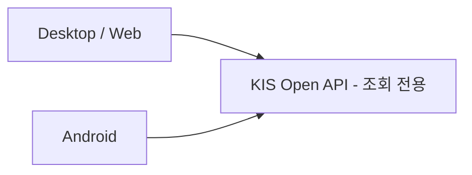

# koreainv-dashboard

Korea Investment Securities dashboard — track portfolio and market monitoring with Google Sheets ops integration in live trading workflows.

[English](README.md) · [](https://github.com/ianlyoo/koreainv-dashboard/actions/workflows/ci.yml) [](LICENSE) [](https://github.com/ianlyoo/koreainv-dashboard/releases) [](https://ianlyoo.github.io/koreainv-dashboard/)

> **소셜 프리뷰:** `https://ianlyoo.github.io/koreainv-dashboard/assets/social-preview.png` (1280×640) — GitHub Settings 수동 업로드는 `docs/OWNER_ACTIONS.md` 참조.

## Android 종목 인사이트

v1.9.6부터 보유 상세에서 미국 주식의 가격 차트·재무·애널리스트·옵션·내부자·뉴스를 확인할 수 있다. PC 없이 직접 연결하며 `설정 → 연결 → SaveTicker`에서 계정을 설정한다. 저장 기본값은 꺼짐이고, 저장을 선택하면 Android Keystore를 사용한다. 백그라운드 복귀 시 앱 PIN을 다시 확인한다.

저사양 기기에서는 유리 효과 비용과 캐시·동시 요청 수를 자동으로 줄인다. [구현·보안·성능 검증](docs/android-insight-validation.md)에 측정 조건과 한계를 정리했다. 데스크톱 연결도 설정 화면에서 관리하며 비밀번호를 `.env`에 추가하지 않는다.

## 빠른 시작 — Google Sheets와 연결된 Korea Investment 대시보드

koreainv-dashboard는 KIS와 Toss 계좌를 집계해 포트폴리오와 마켓 데이터를 보여주고 Google Sheets로 운영을 연결한다.

### Tarball 설치

```bash
gh release download v1.7.1 --repo ianlyoo/koreainv-dashboard --pattern "koreainv-dashboard-*.tgz" --dir /tmp
npm install /tmp/koreainv-dashboard-1.7.1.tgz
```

### 소스 빌드

```bash
git clone https://github.com/ianlyoo/koreainv-dashboard.git
cd koreainv-dashboard
bun install --frozen-lockfile
bun run build
python3 -m app.main
```

앱의 초기 설정 화면에서 계좌 인증 정보를 입력한다. 대시보드는 포트폴리오, 잔고, 시세와 과거 체결 내역을 조회한다.

## 포트폴리오 추적과 주식 대시보드 사용 사례

- KIS와 Toss 보유를 portfolio-tracking 뷰로 추적한다.
- stock-dashboard에서 KRW/USD 전환과 300초 캐시로 finance 현황을 본다.
- Google Sheets를 watchlist와 배분 노트의 기준으로 ops 워크플로를 운영한다.

증권사 데이터 조회 전용 대시보드다. 주문 등록·제출·예약·수정·취소 기능은 제공하지 않는다.

## 아키텍처: kis-api와 모니터링 파이프라인



흐름은 `집계 → 정규화 → Google Sheets ops → 모니터링 insight`이며 모든 계산은 결정론적이다.

## 벤치마크: 측정된 집계와 트레이딩 인사이트 지연

2026-08-19 측정 (seed 42, 조건당 1회, 12 holdings, 3 accounts). 집계 중앙값 210 ms, insight miss 480 ms, hit 18 ms, Google Sheets read 620 ms.

**제한사항:** 1회성 합성 데이터이며 네트워크와 쿼터에 따라 다르다. 캐시 TTL 300초로 실시간 트레이딩 중 stale이 가능하고 결과는 provider 보고 시간이다.

## Developer-tools와 TypeScript, ops

TypeScript 프론트와 Google Sheets ops 헬퍼를 포함한다. `pytest -q`, `ruff`, `bun run build`로 검증한다.

## 라이선스

MIT — [LICENSE](LICENSE) 참조.
