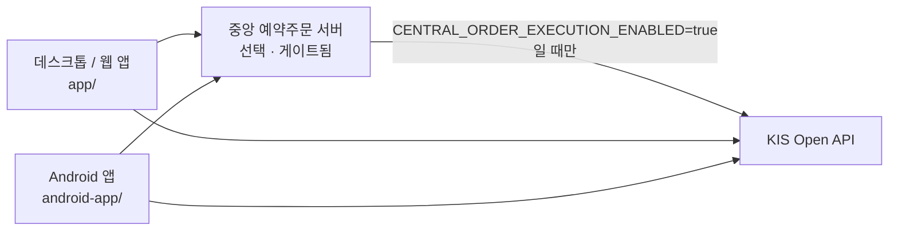

# Korea Investment Dashboard

> 한국투자증권(KIS) API 기반 개인 계좌 대시보드 — 데스크톱·웹·Android

[English](README.en.md) · [MIT License](LICENSE) · Python · Android · 

한국투자증권 계좌의 포트폴리오·자산·거래내역을 한 화면에서 보는 개인용 대시보드다.
데스크톱/웹 앱과 Android 앱, 그리고 GitHub Releases 기반 업데이트 파이프라인을 함께 담고 있다.

**이 프로젝트는 조회 전용이 아니다.** 소규모(1~2인) 운영을 위한 중앙 예약주문 서버
슬라이스가 포함되어 있고, 실제 KIS 주문 실행은 `CENTRAL_ORDER_EXECUTION_ENABLED`로
명시적으로 켜야만 동작한다. 켜지 않으면 실행되지 않는다.

## 아키텍처



## 빠른 시작

릴리스 페이지에서 플랫폼별 아티팩트를 받는다: https://github.com/ianlyoo/koreainv-dashboard/releases

| 플랫폼 | 아티팩트 |
|---|---|
| Android | `KISDashboard-android.apk` |
| Windows | `KISDashboard-win64.zip` |
| macOS | `KISDashboard-mac-arm64.zip` |

최초 실행 시 KIS Open API 키/계좌 정보를 입력하고, Android는 PIN을 설정한 뒤 이후 PIN으로 잠금 해제한다.

## 기능

| 기능 | 설명 |
|------|------|
| 포트폴리오 요약 | 총 평가금액, 평가손익, 수익률, 자산 현황 |
| 자산 상세 | 보유종목·수량·평가금액·손익·자산 분포 |
| 거래내역 | 국내/해외 거래내역 및 실현손익 |
| 통화 전환 | Android에서 주요 금액 KRW/USD 표시 전환 |
| 보안 | Android PIN 잠금 및 로컬 자격정보 저장 |
| 업데이트 | GitHub Releases 기반 최신 버전 확인, 권장/필수 업데이트 처리 |

## 중앙 예약주문 서버 (선택)

1~2인 규모를 위한 중앙 예약주문 서버 슬라이스가 포함되어 있다.

- `CENTRAL_ORDER_SERVER_MODE=true`로 서버 모드를 켠다.
- 원격 클라이언트는 `CENTRAL_ORDER_SERVER_TOKEN`으로 인증한다.
- 저장되는 실행 자격증명은 `CENTRAL_ORDER_MASTER_KEY`(Fernet)로 암호화된다.
- 만기된 주문은 `CENTRAL_ORDER_POLL_INTERVAL_SECONDS`마다 인프로세스 워커가 폴링한다.
- **실제 KIS 실행은 `CENTRAL_ORDER_EXECUTION_ENABLED=true`로만 게이트된다.**
- 예약주문은 쓰기 가능한 user-data 디렉토리의 `scheduled_orders.json`에 저장된다.
- 시작 systemd 유닛 예시: `scripts/koreainv-dashboard-central.service.example`

## 설정 레퍼런스

| 환경변수 | 필수 | 설명 |
|---|---|---|
| `CENTRAL_ORDER_SERVER_MODE` |  | 중앙 서버 모드 활성화 |
| `CENTRAL_ORDER_SERVER_TOKEN` | 서버 모드 시 | 원격 클라이언트 인증 토큰 |
| `CENTRAL_ORDER_MASTER_KEY` | 서버 모드 시 | 저장 자격증명 암호화용 Fernet 키 |
| `CENTRAL_ORDER_EXECUTION_ENABLED` |  | 실제 KIS 주문 실행 게이트 (기본 꺼짐) |
| `CENTRAL_ORDER_POLL_INTERVAL_SECONDS` |  | 만기 주문 폴링 주기 |
| `CENTRAL_ORDER_REMOTE_URL` |  | 데스크톱 클라이언트가 주문을 넘길 중앙 서버 URL |
| `CENTRAL_ORDER_REMOTE_TOKEN` |  | 원격 전달용 토큰 |
| `COOKIE_SECURE` |  | HTTPS 뒤 배포 시 `true` |

### Oracle Ubuntu 배포 참고

1. `CENTRAL_ORDER_MASTER_KEY`용 Fernet 키를 생성한다.
2. `COOKIE_SECURE=true`로 둔다.
3. HTTPS 리버스 프록시(Nginx/Caddy) 뒤에서 돌리고 `CENTRAL_ORDER_SERVER_TOKEN`을 비공개로 유지한다.
4. 주문을 중앙 서버로 전달할 데스크톱 클라이언트에 `CENTRAL_ORDER_REMOTE_URL`/`CENTRAL_ORDER_REMOTE_TOKEN`을 설정한다.

## 보안

- 주문 실행 경로가 존재하므로 `CENTRAL_ORDER_EXECUTION_ENABLED`는 의도적으로 켤 때만 활성화한다.
- 저장 실행 자격증명은 `CENTRAL_ORDER_MASTER_KEY`로 암호화되어 저장된다.
- API 키·계좌번호·PIN·설정 파일은 외부에 공유하지 않는다.
- 중앙 서버는 HTTPS 뒤에서만 노출하고 서버 토큰을 비공개로 유지한다.

## 릴리스 방식

GitHub Actions `Build And Release` 워크플로(`.github/workflows/release.yml`)로 릴리스한다.

- 태그 푸시: `v*`
- 태그 버전은 `app/version.py`(`APP_VERSION`)와 `android-app/app/build.gradle.kts`와 일치해야 한다.

```bash
git tag -a v1.6.5 -m "Prepare v1.6.5 release"
git push origin v1.6.5
```

annotated tag 메시지에 아래 문자열이 포함되면 필수 업데이트로 처리된다:
`[mandatory-update]`, `mandatory-update`, `update_policy: mandatory`, `필수 업데이트`.

## 개발

```bash
python -m app.main            # 웹/로컬 앱 실행
build_windows.bat             # Windows 배포본
./scripts/build_mac_app.sh    # macOS 배포본
cd android-app && ./gradlew assembleRelease   # Android
```

버전 소스: 데스크톱/웹은 `app/version.py`, Android는 `android-app/app/build.gradle.kts`. 정책 문서는 `RELEASE_POLICY.md`.

## 문제 해결

| OS | 경로 |
|---|---|
| Windows | 설정 `%APPDATA%\KISDashboard\settings.json`, 로그 `%APPDATA%\KISDashboard\logs\` |
| macOS | 로그 `~/Library/Logs/KISDashboard/`, 업데이트 `~/Library/Application Support/KISDashboard/updates` |

## Disclaimer

투자 보조 도구이며 투자 손실에 대한 책임을 지지 않는다. API 키·계좌번호·PIN·설정 파일을 외부에 공유하지 않는다.

## License

[MIT](LICENSE) © 2026 AhnRyu
