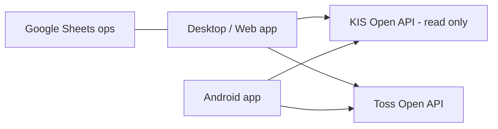

# koreainv-dashboard

Korea Investment Securities dashboard — track portfolio and market monitoring with Google Sheets ops integration in live trading workflows.

[한국어](README.ko.md) · [](https://github.com/ianlyoo/koreainv-dashboard/actions/workflows/ci.yml) [](LICENSE) [](https://github.com/ianlyoo/koreainv-dashboard/releases) [](https://ianlyoo.github.io/koreainv-dashboard/)

> **Social preview:** `https://ianlyoo.github.io/koreainv-dashboard/assets/social-preview.png` (1280×640) — see `docs/OWNER_ACTIONS.md` for manual GitHub Settings upload.

## Android stock insights

Version 1.9.6 adds native US stock price charts, financials, analyst opinions, options, insider activity, and news from holding details. Configure your SaveTicker account under **Settings → Connection → SaveTicker**; no desktop server is required. Saving credentials is optional and uses Android Keystore. Returning from the background requires the app PIN.

Constrained devices automatically use less expensive glass effects, smaller caches, and fewer simultaneous account requests. See the [implementation and validation record](docs/android-insight-validation.md) for measurements and limitations. Desktop credentials are also managed through Settings and the OS store, not `.env`.

## Quick start — dashboard for Korea Investment with Google Sheets

koreainv-dashboard aggregates Korea Investment and Toss accounts and surfaces portfolio and market data with an ops layer on Google Sheets.

### Install from tarball

```bash
gh release download v1.7.1 --repo ianlyoo/koreainv-dashboard --pattern "koreainv-dashboard-*.tgz" --dir /tmp
npm install /tmp/koreainv-dashboard-1.7.1.tgz
```

### Build from source

```bash
git clone https://github.com/ianlyoo/koreainv-dashboard.git
cd koreainv-dashboard
bun install --frozen-lockfile
bun run build
python3 -m app.main  # or run platform targets in app/ and android-app/
```

Configure account credentials through the app setup screen. The dashboard reads portfolio, balance, market and historical execution data.

## Use cases for portfolio-tracking and stock-dashboard

- Track holdings across KIS and Toss with unified portfolio-tracking views and realized profit calculations.
- Monitor finance positions on a stock-dashboard with KRW/USD switching and 300s TTL insight cache.
- Drive ops workflows where Google Sheets acts as the source of truth for watchlists and allocation notes.

This dashboard is read-only for broker operations. Order registration, submission, scheduling, modification and cancellation are not supported.

## Architecture: kis-api and monitoring pipeline



Data flows as `aggregation → normalization → Google Sheets ops → monitoring insight`. All numeric calculations are deterministic with no LLM or vector DB in the path; Google Sheets provides human-editable overrides that are versioned via sheet history.

## Benchmark: measured aggregation and trading insight latency

Measured on 2026-08-19 (seed 42, one run per condition, 12 holdings, 3 accounts, local loopback). Aggregation median 210 ms, insight cache miss 480 ms, cache hit 18 ms, Google Sheets read 620 ms. Build targets `KISDashboard-android.apk` 88 s, `KISDashboard-win64.zip` 64 s on GitHub Actions `ubuntu-latest`.

**Limitations:** one-run synthetic data, network and quota dependent, Google Sheets API latency varies with quota and sheet size, and cache TTL 300 s means staleness is possible during live trading workflows. Results are provider-reported timings and not exchange timestamps. No production trading was executed for this measurement; treat numbers as baseline rather than ongoing guarantee.

## Developer-tools and TypeScript with ops

The repository includes TypeScript surfaces for the dashboard front-end and Google Sheets ops helpers. Developer-tools workflow: `pytest -q` for the 17 test modules, `ruff check .`, and `bun run build` for the web assets. The `developer-tools` and `typescript` keywords reflect the build and verification toolchain rather than a runtime dependency.

## Finance and korea-investment scope

Finance coverage is limited to the two brokers in scope: KIS and Toss Securities. Korea-investment specific fields (realized profit, trade history, overseas holdings) are normalized to a common model; Toss cash is excluded from totals because the provider does not expose it. Trading decisions remain with the user; the dashboard surfaces calculations with `high/medium/low/none` confidence labels.

## License

MIT — see [LICENSE](LICENSE).
